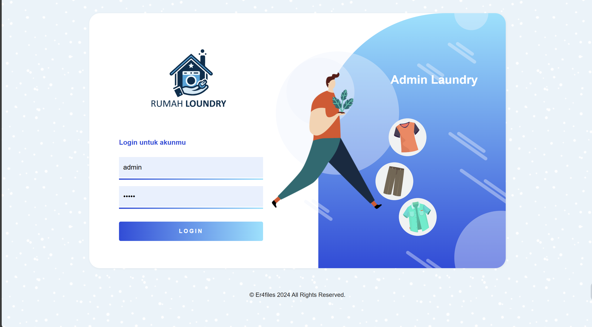
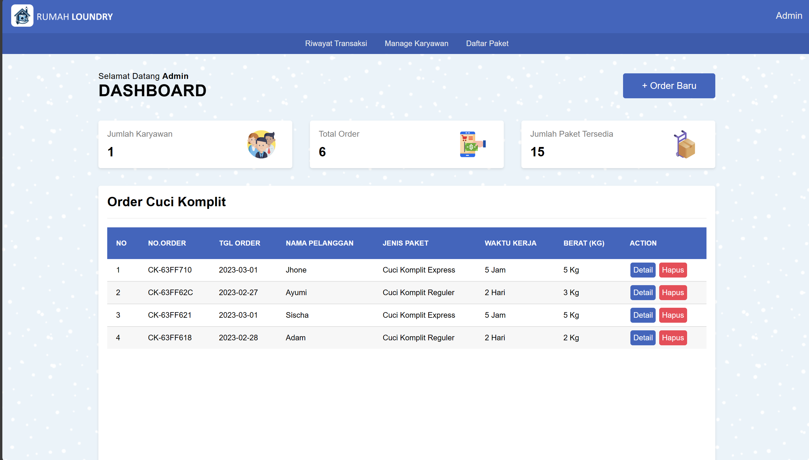

# Web Rumah Laundry

Ini adalah aplikasi web Rumah Laundry, sebuah platform yang dirancang untuk memudahkan pengguna dalam memesan jasa laundry secara online. Dengan antarmuka yang ramah pengguna, pengguna dapat dengan mudah menjadwalkan layanan laundry tanpa harus pergi ke tempat laundry secara fisik.

## Screenshot

## Teknologi yang Digunakan

- HTML
- CSS
- JavaScript
- PHP
- MySQL

## 🚀 Panduan Instalasi Web Rumah Laundry

Langkah 1: Persiapan Awal

- 📥 Unduh file instalasi dari repositori ini di GitHub 
   [er4files](https://github.com/er4files/Rumah-Laundry-Aplikasi-Web).
- 📂 Ekstrak file zip yang telah diunduh ke dalam satu folder. 
   Beri nama folder tersebut sebagai "rumah_laundry".
- 📁 Pindahkan folder "rumah_laundry" ke dalam direktori xampp/htdocs/.

Langkah 2: Aktivasi Server Web

1. 🚀 Aktifkan server web menggunakan platform seperti LAMP, XAMPP, WAMPP, dsb.
2. 💡 Nyalakan layanan Apache dan MySQL.

Langkah 3: Pengaturan Database

1. 🌐 Buka web browser dan ketikkan localhost/phpmyadmin pada address bar.
2. 🛠️ Buat database baru dengan nama "laundry_app".
3. 🔍 Pilih database "laundry_app" setelah dibuat.
4. 📤 Impor file SQL dengan klik menu/tab "Import" di bagian atas phpMyAdmin.
5. 📎 Klik "Choose file", cari file "laundry_app.sql", 
   dan klik tombol "Kirim/Go" (scroll ke bawah).

Langkah 4: Instalasi Aplikasi

1. 🌐 Buka tab baru pada web browser dan ketikkan localhost/rumah_laundry/.
2. 🔧 Ikuti petunjuk untuk mengisi informasi login.

Informasi Login:
- 👤 Username: admin
- 🔐 Password: admin

Selamat, Anda Telah Sukses Menginstal Aplikasi Rumah Laundry! 🎉
